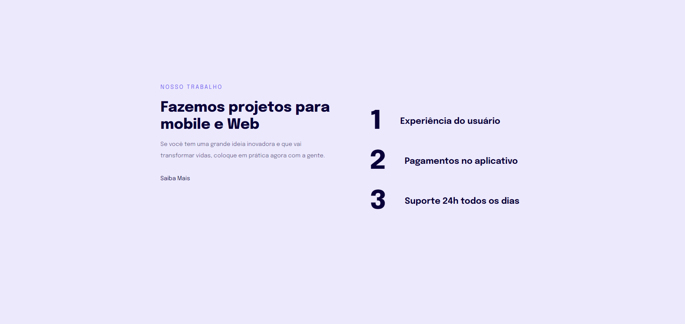

<h1 align="center">Introdução a responsividade</h1>
<h3> Projeto introdutório sobre responsividade desenvolvido no Explorer da Rocketseat.</h3>

## Descrição do Projeto

Esse Projeto é o Front-end introdutório sobre responsividade desenvolvido no Explorer da Rocketseat.

## Instalação

Basta baixar o repositório na sua máquina, abrir na IDE de sua preferência e executar o arquivo HTML em seu navegador.

## Licença

MIT License.
Copyright (c) 2022.

## 🚀 Tecnologias Utilizadas

